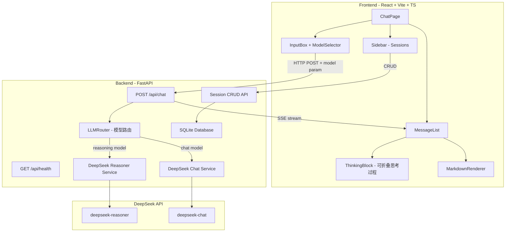
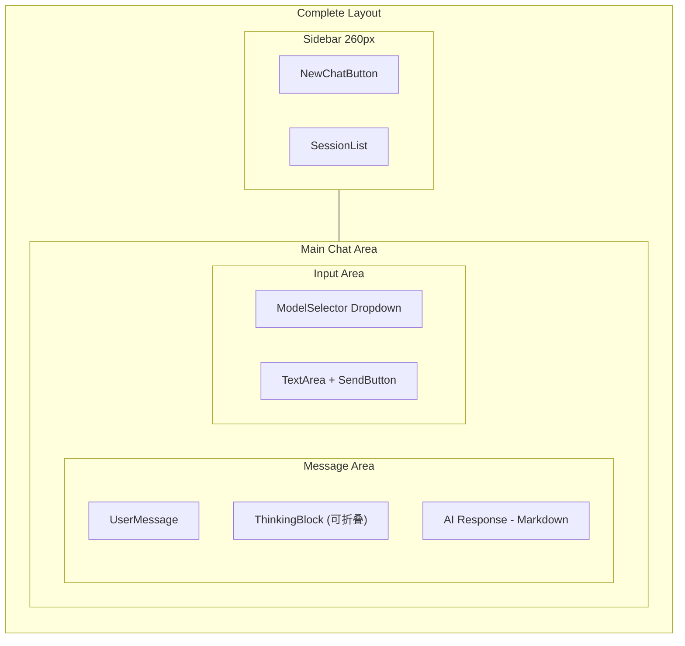
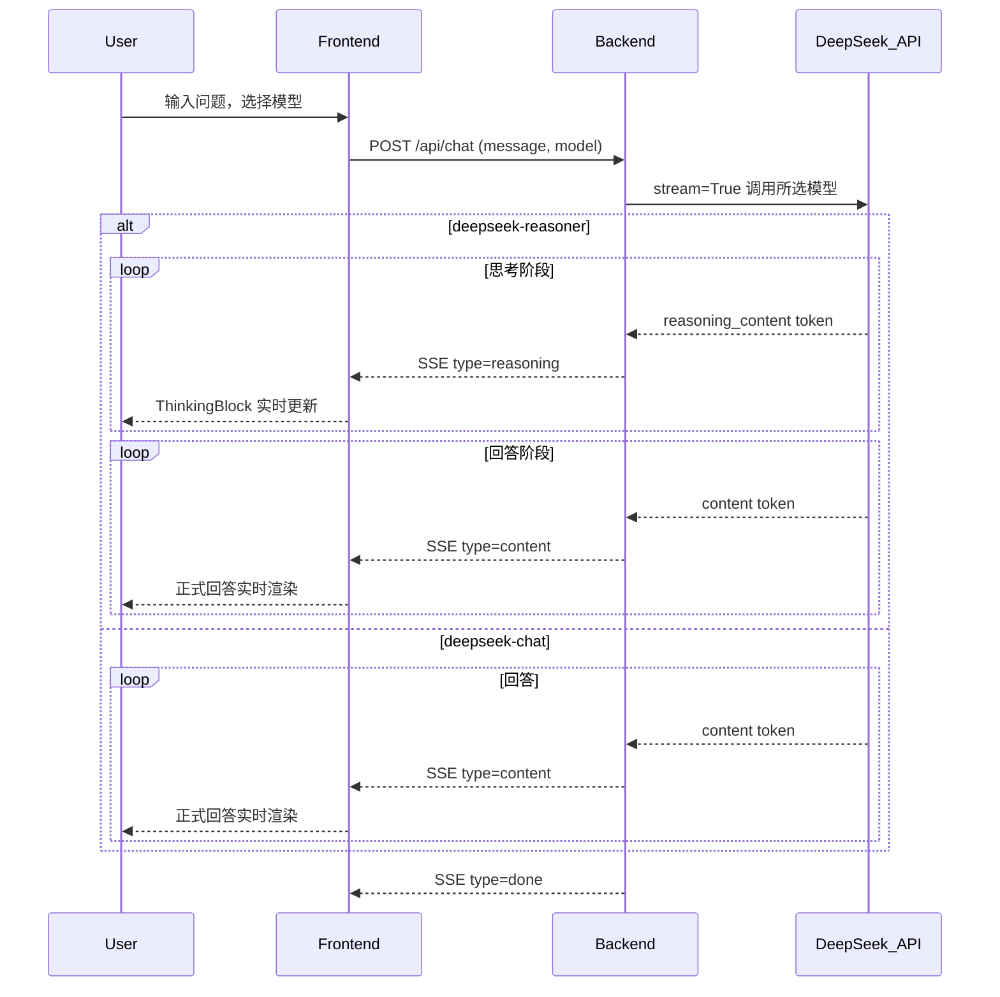
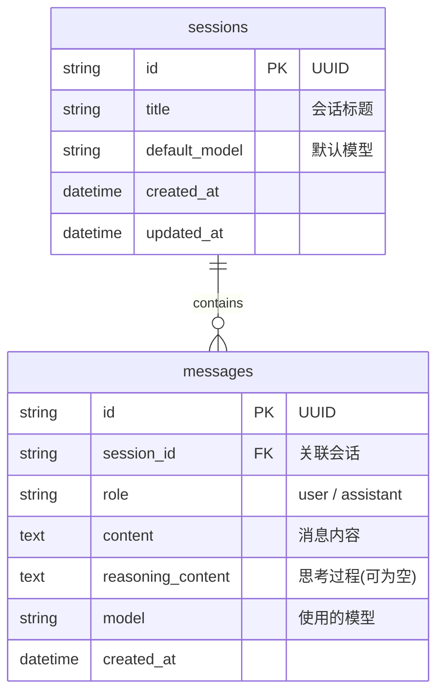

# 类 ChatGPT 对话问答系统 -- 技术架构与功能规划

## 整体架构




## 项目目录结构

```
chatbot/
├── frontend/                       # React 前端
│   ├── public/
│   ├── src/
│   │   ├── components/
│   │   │   ├── ChatMessage.tsx      # 单条消息（含思考过程折叠）
│   │   │   ├── ChatInput.tsx        # 输入框 + 模型选择下拉
│   │   │   ├── Sidebar.tsx          # 侧边栏会话列表
│   │   │   ├── SessionItem.tsx      # 会话列表项
│   │   │   ├── ThinkingBlock.tsx    # 可折叠思考过程组件
│   │   │   ├── MarkdownBlock.tsx    # Markdown 渲染
│   │   │   ├── ModelSelector.tsx    # 模型切换下拉选择器
│   │   │   └── WelcomeScreen.tsx    # 空会话欢迎页
│   │   ├── pages/
│   │   │   └── ChatPage.tsx         # 主聊天页
│   │   ├── hooks/
│   │   │   └── useChat.ts           # 聊天逻辑 Hook
│   │   ├── services/
│   │   │   └── api.ts               # 后端 API 调用
│   │   ├── store/
│   │   │   └── chatStore.ts         # Zustand 状态管理
│   │   ├── types/
│   │   │   └── index.ts             # TypeScript 类型定义
│   │   ├── mocks/
│   │   │   └── mockData.ts          # Phase 2 使用的 Mock 数据
│   │   ├── App.tsx
│   │   └── main.tsx
│   ├── package.json
│   └── vite.config.ts
│
├── backend/
│   ├── app/
│   │   ├── main.py                  # FastAPI 入口
│   │   ├── config.py                # 配置管理
│   │   ├── routers/
│   │   │   ├── health.py            # 健康检查路由
│   │   │   ├── chat.py              # 聊天路由（SSE 流式）
│   │   │   └── session.py           # 会话管理路由
│   │   ├── services/
│   │   │   ├── llm_service.py       # LLM 统一调用层
│   │   │   ├── reasoner_service.py  # DeepSeek Reasoner 封装
│   │   │   └── chat_service.py      # DeepSeek Chat 封装
│   │   ├── models/
│   │   │   └── schemas.py           # Pydantic 数据模型
│   │   └── database/
│   │       ├── db.py                # 数据库连接
│   │       └── models.py            # ORM 模型
│   ├── requirements.txt
│   └── .env
│
└── README.md
```

## 技术选型总览

**后端:**

- **FastAPI** -- 异步高性能 Python Web 框架
- **SQLAlchemy** + **SQLite** -- ORM + 轻量数据库 (Phase 5)
- **openai** Python SDK -- 调用 DeepSeek API（兼容 OpenAI 格式）
- **Pydantic** -- 请求/响应数据校验
- **python-dotenv** -- 环境变量管理
- **uvicorn** -- ASGI 服务器

**前端:**

- **React 18** + **TypeScript** -- 前端框架
- **Vite** -- 构建工具
- **Zustand** -- 轻量状态管理
- **react-markdown** + **rehype-highlight** + **remark-gfm** -- Markdown 渲染 + 代码高亮
- **Tailwind CSS** -- 原子化 CSS
- **lucide-react** -- 图标库

---

## Phase 1: 项目脚手架与健康检查

**目标:** 创建前后端项目骨架，安装所有依赖，实现健康检查接口，验证前后端通信链路畅通。本阶段不涉及业务逻辑，只确保基础设施就绪。

**涉及文件:**

- `backend/app/main.py` -- FastAPI 入口，挂载路由、配置 CORS
- `backend/app/config.py` -- 配置管理
- `backend/app/routers/health.py` -- 健康检查路由
- `backend/requirements.txt` -- Python 依赖清单
- `backend/.env` -- 环境变量模板
- `frontend/src/App.tsx` -- React 根组件
- `frontend/src/main.tsx` -- 入口
- `frontend/vite.config.ts` -- Vite 配置（含 API 代理）
- `frontend/package.json` -- 前端依赖清单

**具体任务:**

1. **后端初始化:**
  - 创建 `backend/` 目录结构
  - 编写 `requirements.txt`: fastapi, uvicorn, openai, python-dotenv, pydantic, sqlalchemy, aiosqlite
  - 编写 `config.py`: 从 `.env` 读取配置（DEEPSEEK_API_KEY, MODEL_NAME 等）
  - 编写 `.env` 模板（含占位符）
  - 编写 `routers/health.py`:
    - `GET /api/health` -- 返回 `{"status": "ok", "timestamp": "..."}`
  - 编写 `main.py`: 创建 FastAPI app，挂载 health 路由，配置 CORS
2. **前端初始化:**
  - 使用 Vite 创建 React + TypeScript 项目
  - 安装依赖: zustand, tailwindcss, postcss, autoprefixer, lucide-react, react-markdown, rehype-highlight, remark-gfm, highlight.js
  - 配置 Tailwind CSS
  - 配置 `vite.config.ts`: 将 `/api` 代理到 `http://localhost:8000`
  - 编写 `App.tsx`: 页面启动时调用 `/api/health` 并在控制台打印结果
3. **联通性验证:**
  - 启动后端: `uvicorn app.main:app --reload --port 8000`
  - 启动前端: `npm run dev`
  - 前端页面加载后控制台输出 `{"status": "ok"}` 即验证成功

**验收标准:**

- 后端 `GET http://localhost:8000/api/health` 返回 200 + JSON
- 前端 `npm run dev` 启动成功，页面可访问
- 前端能通过 Vite 代理成功调用后端 health 接口
- 两端无报错，依赖安装完整

---

## Phase 2: 前端 UI 开发（Mock 数据驱动）

**目标:** 用 Mock 数据完成所有前端 UI 组件开发，包括完整的聊天界面布局、Markdown 渲染、代码高亮、思考过程折叠块、模型选择下拉器。本阶段不对接真实后端，前端可独立运行验证所有交互。

**涉及文件:**

- `frontend/src/types/index.ts` -- 类型定义
- `frontend/src/mocks/mockData.ts` -- Mock 数据
- `frontend/src/store/chatStore.ts` -- Zustand 状态管理
- `frontend/src/components/ChatMessage.tsx` -- 消息气泡
- `frontend/src/components/ChatInput.tsx` -- 输入框
- `frontend/src/components/ThinkingBlock.tsx` -- 思考过程折叠块
- `frontend/src/components/MarkdownBlock.tsx` -- Markdown 渲染
- `frontend/src/components/ModelSelector.tsx` -- 模型切换下拉
- `frontend/src/components/Sidebar.tsx` -- 侧边栏
- `frontend/src/components/SessionItem.tsx` -- 会话项
- `frontend/src/components/WelcomeScreen.tsx` -- 欢迎空状态
- `frontend/src/pages/ChatPage.tsx` -- 主页面

**页面布局:**




**具体任务:**

1. **类型定义 (`types/index.ts`):**
  - `Message`: id, role (user/assistant), content, reasoning_content?, model, created_at
  - `Session`: id, title, created_at, updated_at
  - `ModelType`: "deepseek-reasoner" | "deepseek-chat"
2. **Mock 数据 (`mocks/mockData.ts`):**
  - 包含多个模拟会话、消息（含 reasoning_content 的推理消息和普通 chat 消息）
  - 模拟 Markdown 内容: 代码块、表格、列表等
  - 用于驱动所有 UI 组件的开发和调试
3. **核心组件开发:**
  a. **MarkdownBlock.tsx** -- Markdown 渲染:
      - 使用 `react-markdown` + `remark-gfm` + `rehype-highlight`
      - 代码块: 显示语言标签 + 复制按钮
      - 引入 highlight.js 主题 CSS (github-dark)
      - 支持表格、列表、行内代码、粗体、链接
   b. **ThinkingBlock.tsx** -- 思考过程可折叠块:
      - 默认收起状态，显示 "思考过程" + 展开图标
      - 点击展开后显示 reasoning_content 内容（也使用 Markdown 渲染）
      - 收起/展开有平滑过渡动画
      - 思考中状态: 显示 "思考中..." + 动画指示器
      - 视觉上与正式回复区分（浅色背景/边框/缩进）
   c. **ModelSelector.tsx** -- 模型切换下拉:
      - 下拉选择器，选项: "DeepSeek 推理模型" / "DeepSeek 对话模型"
      - 显示当前选中模型名称和图标
      - 位于输入框上方或左侧
   d. **ChatMessage.tsx** -- 单条消息:
      - 用户消息: 右对齐，蓝色气泡
      - AI 消息: 左对齐，包含:
        - 如果有 reasoning_content -> 先显示 ThinkingBlock
        - 正式回复内容通过 MarkdownBlock 渲染
      - 显示模型标识（推理模型/对话模型）
   e. **ChatInput.tsx** -- 输入区域:
      - TextArea 自适应高度
      - Enter 发送 / Shift+Enter 换行
      - 发送按钮（加载中显示 loading 状态）
      - 集成 ModelSelector
   f. **Sidebar.tsx + SessionItem.tsx** -- 侧边栏:
      - 顶部 "新建对话" 按钮
      - 会话列表（当前激活项高亮）
      - 支持删除、重命名交互
      - 可折叠（响应式）
   g. **WelcomeScreen.tsx** -- 空状态欢迎页:
      - 应用 Logo / 标题
      - 功能介绍或示例提问
   h. **ChatPage.tsx** -- 主页面组合:
      - 左右分栏: Sidebar + Chat Area
      - 消息列表自动滚动到底部
      - 无消息时显示 WelcomeScreen
4. **状态管理 (`chatStore.ts`):**
  - sessions / currentSessionId / messages / selectedModel / isLoading
  - 用 Mock 数据初始化
  - 实现 switchSession / addMessage / setModel 等 action
5. **UI 风格:**
  - 深色主题为主（类 ChatGPT 风格）
  - Tailwind CSS 实现
  - 过渡动画、hover 效果

**验收标准:**

- 页面完整展示: Sidebar + 消息列表 + 输入框 + 模型选择器
- 可切换会话，消息列表正确刷新
- AI 消息中 Markdown 正确渲染（代码高亮 + 复制按钮 + 表格等）
- 推理模型消息显示可折叠的思考过程块，展开/收起动画流畅
- 对话模型消息不显示思考过程块
- 模型下拉可切换，UI 反馈正确
- 整体视觉风格统一，无布局错位

---

## Phase 3: 后端 DeepSeek 集成与前后端联调

**目标:** 后端接入 DeepSeek API，实现流式聊天接口。重点是 `deepseek-reasoner` 模型的 `reasoning_content`（思考过程）通过 SSE 分段推送给前端，前端改用真实接口替换 Mock 数据。

**涉及文件:**

- `backend/app/services/llm_service.py` -- LLM 统一调用层
- `backend/app/routers/chat.py` -- 聊天路由（SSE 流式）
- `backend/app/models/schemas.py` -- 请求/响应模型
- `frontend/src/services/api.ts` -- 后端 API 调用
- `frontend/src/hooks/useChat.ts` -- 聊天逻辑 Hook
- `frontend/src/store/chatStore.ts` -- 状态管理改造

**SSE 数据流设计:**

DeepSeek Reasoner 的响应包含两个阶段: 先输出 `reasoning_content`（思考过程），再输出 `content`（最终回答）。SSE 事件格式:

```
data: {"type": "reasoning", "token": "让我分析一下这个问题..."}
data: {"type": "reasoning", "token": "首先考虑..."}
data: {"type": "content", "token": "根据分析，"}
data: {"type": "content", "token": "答案是..."}
data: {"type": "done", "model": "deepseek-reasoner"}
```

**数据流（含思考过程）:**




**具体任务:**

1. **后端 -- LLM 服务层:**
  - 编写 `llm_service.py`: 封装 DeepSeek API 调用，使用 openai SDK
  - 支持 `deepseek-reasoner` 模型: 解析 `chunk.choices[0].delta.reasoning_content` 字段
  - 支持 `deepseek-chat` 模型: 解析 `chunk.choices[0].delta.content` 字段
  - 统一的异步生成器接口，yield SSE 事件 (type + token)

```python
async def stream_chat(messages: list[dict], model: str):
    response = client.chat.completions.create(
        model=model, messages=messages, stream=True
    )
    for chunk in response:
        delta = chunk.choices[0].delta
        if hasattr(delta, 'reasoning_content') and delta.reasoning_content:
            yield {"type": "reasoning", "token": delta.reasoning_content}
        if delta.content:
            yield {"type": "content", "token": delta.content}
    yield {"type": "done", "model": model}
```

1. **后端 -- 聊天路由:**
  - `POST /api/chat`: 接收 `{message, model, history[]}`
  - 返回 `StreamingResponse`，media_type="text/event-stream"
  - 每个 SSE 事件格式: `data: {json}\n\n`
2. **后端 -- 数据模型:**
  - `ChatRequest`: message (str), model (str), history (list[MessageItem])
  - `MessageItem`: role (str), content (str)
3. **前端 -- API 层改造:**
  - `api.ts`: 实现 `sendMessage(message, model, history)` 函数
  - 使用 `fetch` + `ReadableStream` 解析 SSE
  - 区分 `type=reasoning` 和 `type=content` 事件
4. **前端 -- useChat Hook 改造:**
  - 接收到 `type=reasoning` 时更新当前消息的 `reasoning_content`
  - 接收到 `type=content` 时更新当前消息的 `content`
  - 接收到 `type=done` 时标记完成
  - 思考阶段 ThinkingBlock 显示 "思考中..." 实时文字
5. **前端 -- 移除 Mock 依赖:**
  - chatStore 不再用 Mock 数据初始化
  - 所有消息通过真实 API 获取

**验收标准:**

- 选择 deepseek-reasoner 模型发送消息后:
  - ThinkingBlock 实时显示思考过程文字（流式）
  - 思考完成后，正式回答逐字流式显示
  - ThinkingBlock 可折叠/展开
- 选择 deepseek-chat 模型发送消息后:
  - 直接流式显示回答，无思考过程块
- 多轮对话上下文正确传递
- 错误处理: API 超时或失败时前端显示友好提示

---

## Phase 4: 双模型服务接口完善

**目标:** 完善两种模型的服务接口差异处理，实现模型能力差异化展示，优化前端模型切换体验。

**涉及文件:**

- `backend/app/services/reasoner_service.py` -- Reasoner 模型专属逻辑
- `backend/app/services/chat_service.py` -- Chat 模型专属逻辑
- `backend/app/services/llm_service.py` -- 统一路由层改造
- `backend/app/routers/chat.py` -- 路由改造
- `backend/app/models/schemas.py` -- 模型信息 Schema
- `frontend/src/components/ModelSelector.tsx` -- 增强模型信息展示
- `frontend/src/components/ChatMessage.tsx` -- 模型标识展示
- `frontend/src/store/chatStore.ts` -- 模型状态管理

**两种模型对比:**

- **deepseek-reasoner (推理模型)**:
  - 擅长数学、逻辑、编程等需要深度思考的任务
  - 响应包含 reasoning_content（思考过程） + content（最终回答）
  - 不支持 temperature 等采样参数
  - 不支持 system message，需要使用 user 角色替代
- **deepseek-chat (对话模型)**:
  - 通用对话，快速响应
  - 仅返回 content
  - 支持 temperature, top_p 等参数
  - 支持 system message

**具体任务:**

1. **后端 -- 拆分模型服务:**
  - `reasoner_service.py`: 封装 deepseek-reasoner 调用逻辑
    - 处理 reasoning_content 字段
    - 将 system message 转换为 user message（reasoner 不支持 system role）
    - 固定不传 temperature 等参数
  - `chat_service.py`: 封装 deepseek-chat 调用逻辑
    - 支持 system message
    - 支持 temperature 参数（可选）
  - `llm_service.py`: 统一路由，根据 model 参数分发到对应 service
2. **后端 -- 模型信息接口:**
  - `GET /api/models` -- 返回可用模型列表及其能力描述:

```json
   [
     {"id": "deepseek-reasoner", "name": "DeepSeek 推理模型", "description": "擅长数学、逻辑推理、编程", "supports_thinking": true},
     {"id": "deepseek-chat", "name": "DeepSeek 对话模型", "description": "通用对话，快速响应", "supports_thinking": false}
   ]
   

```

1. **前端 -- ModelSelector 增强:**
  - 从 `/api/models` 获取模型列表（而非硬编码）
  - 下拉选项显示模型名称 + 简短描述
  - 切换模型时存入 chatStore
2. **前端 -- ChatMessage 模型标识:**
  - AI 消息头部显示所用模型名称（小字标签）
  - 不同模型可用不同颜色标识
3. **前端 -- 智能 UI 适配:**
  - 选择 reasoner 模型时: ThinkingBlock 区域预留
  - 选择 chat 模型时: ThinkingBlock 区域不显示
  - 历史消息中如果某条用了 reasoner 模型，仍显示其思考过程

**验收标准:**

- 下拉选择器显示两个模型及描述
- 切换到推理模型 -> 回复包含思考过程 + 最终回答
- 切换到对话模型 -> 回复仅有最终回答，无思考块
- 同一会话中可混用两种模型，历史消息各自正确显示
- `/api/models` 接口返回正确的模型信息

---

## Phase 5: 数据持久化与会话管理

**目标:** 后端集成 SQLite 数据库，持久化存储会话和消息（含思考过程）。前端 Sidebar 对接会话 CRUD API，实现完整的会话生命周期管理。

**涉及文件:**

- `backend/app/database/db.py` -- 数据库连接
- `backend/app/database/models.py` -- ORM 模型
- `backend/app/routers/session.py` -- 会话 CRUD 路由
- `backend/app/routers/chat.py` -- 改造，消息持久化
- `backend/app/models/schemas.py` -- 会话相关 Schema
- `frontend/src/services/api.ts` -- 会话 API 调用
- `frontend/src/store/chatStore.ts` -- 会话状态管理
- `frontend/src/components/Sidebar.tsx` -- 对接真实 API
- `frontend/src/hooks/useChat.ts` -- 改造，关联会话

**数据库表设计:**




**具体任务:**

1. **后端 -- 数据库层:**
  - `database/db.py`: 创建 SQLite 引擎、Session 工厂、Base
  - `database/models.py`: 定义 Session 和 Message ORM 模型
  - messages 表包含 `reasoning_content` 和 `model` 字段
2. **后端 -- 会话 CRUD API (`routers/session.py`):**
  - `GET /api/sessions` -- 会话列表（按 updated_at 倒序）
  - `POST /api/sessions` -- 创建新会话
  - `GET /api/sessions/{id}` -- 获取会话详情 + 消息历史
  - `DELETE /api/sessions/{id}` -- 删除会话（级联删除消息）
  - `PUT /api/sessions/{id}` -- 更新会话标题
3. **后端 -- 聊天路由改造:**
  - 收到消息时存入 messages 表
  - 从数据库加载历史消息构建上下文
  - AI 回复完成后保存 content + reasoning_content + model
  - 首条消息自动生成会话标题
4. **前端 -- 会话管理对接:**
  - `api.ts`: 新增 sessions CRUD 调用
  - `chatStore.ts`: sessions 列表、currentSessionId、fetchSessions / createSession / deleteSession / renameSession
  - `Sidebar.tsx`: 调真实 API，新建/切换/删除/重命名
  - `useChat.ts`: 发送消息带 session_id，无 session 时自动创建
5. **前端 -- 完善交互:**
  - 页面初始化加载会话列表
  - 切换会话时从 API 加载历史消息（含 reasoning_content）
  - 删除确认对话框
  - 空状态 / 加载状态处理

**验收标准:**

- 刷新页面后会话和消息完整保留
- 新建/切换/删除/重命名会话全部正常
- 历史消息中推理模型的思考过程可正确展开查看
- 重启后端服务后数据不丢失
- 整体功能闭环，无明显 Bug

