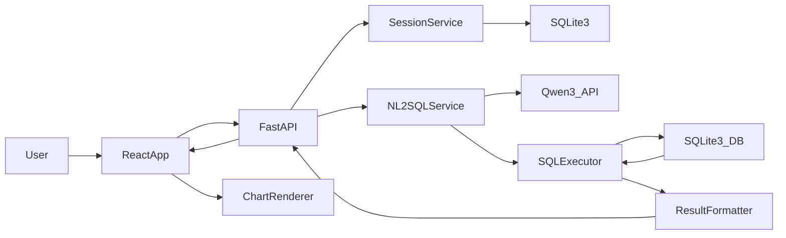

# 智能数据分析系统分阶段实施方案（system_plan_1.0）

## 一、总体目标

- **系统能力**：
  - 接入阿里云百炼 Qwen3 模型，通过 LangChain 在后端实现自然语言 → SQL 转换。
  - 使用 FastAPI + SQLite3 搭建后端服务，支持会话管理与上下文记忆。
  - 使用 React 实现前端应用，布局为：左侧会话管理、中间问答区域、右侧可视化图表实时展示查询结果。
- **高层架构**：

---

## 二、Phase 1：前后端基础框架搭建 & 运行测试

**目标**：在本地搭建最小可运行的前后端骨架，完成健康检查级别的联通性验证。

- **后端基础（FastAPI + SQLite3）**
  - 初始化后端项目结构（示例）：
    - `app/main.py`：应用入口与路由挂载。
    - `app/api`：路由模块（后续放置会话和聊天接口）。
    - `app/db`：SQLite3/ORM 初始化（推荐 SQLAlchemy/SQLModel）。
    - `app/core`：配置加载、日志等。
  - 配置 SQLite3 连接（先只建一张简单测试表或暂不建业务表）。
  - 实现 `GET /health` 健康检查接口，返回 `{ "status": "ok" }`。
  - 预留百炼 Qwen3 配置位：从 `.env` 读取 `BAILIAN_API_KEY`、`BAILIAN_ENDPOINT` 等，但本阶段可不真正调用模型。
- **前端基础（React）**
  - 使用 Vite / Create React App 初始化 React 项目，划分基本目录：
    - `src/components`、`src/pages`、`src/services`、`src/layouts` 等。
  - 选定并集成基础 UI 框架（如 Ant Design / MUI），设置全局主题与样式。
  - 在主页中调用后端 `/health` 接口，在界面上展示后端状态（如“后端在线/离线”）。
- **测试与验收**
  - 后端：使用浏览器或 Postman 访问 `/health`，确认返回 `200 + {"status":"ok"}`。
  - 前端：本地运行开发服务器，确认页面能正确展示后端健康状态。
  - 在 `README` 记录当前启动步骤与健康检查方法。

---

## 三、Phase 2：前端 UI 研发（三栏布局与基础交互）

**目标**：在不依赖真实后端业务接口的前提下，完成核心 UI 布局和主要交互流程，全部基于前端 mock 数据。

- **整体三栏布局实现**
  - 使用 Flex 或 CSS Grid 搭建布局：
    - 左侧：会话列表区（约 20–25% 宽度）。
    - 中间：问答聊天区（约 40–50% 宽度）。
    - 右侧：图表展示区（约 30–35% 宽度）。
  - 保证在常见分辨率下布局稳定，可为小屏简单压缩或折叠某些区域。
- **左侧会话管理 UI**
  - 组件划分：
    - `SessionList`：会话列表（使用 mock 会话数据）。
    - `NewSessionButton`：新建会话按钮（本阶段仅在本地状态中新增）。
  - 功能：点击会话项切换当前会话高亮，左侧不与真实后端通信。
- **中间问答区域 UI**
  - 组件划分：
    - `ChatWindow`：中间区域容器。
    - `MessageList`：对话消息列表（用户气泡、助手气泡样式区分）。
    - `MessageInput`：输入框组件，支持回车发送和按钮发送。
  - 行为：
    - 用户输入后，将消息追加到 `MessageList`。
    - 使用 mock 的“助手回复”（例如延时 0.5 秒后插入一条固定回复）。
    - 提供简单的 Loading/“助手正在思考”状态指示。
- **右侧图表展示 UI**
  - 选择前端图表库（建议：Recharts 或 ECharts for React）。
  - 组件划分：
    - `ChartPanel`：接收 `chartSpec` + `data`（目前为 mock）并渲染图表。
    - 支持至少柱状图和折线图两种类型切换（通过前端控件或 tab）。
  - 使用静态 mock 数据制作 2–3 个展示案例，确保图表交互顺畅。
- **状态管理设计（前端）**
  - 使用 React Context + Hooks 实现：
    - `SessionContext`：当前选中会话 ID、本地会话列表（mock）。
    - `ChatContext`：每个会话的消息列表、当前图表数据（mock）。
  - 为后续接入真实后端预留 API 调用位置（如 `services/api.ts` 中定义接口函数但暂时返回 mock）。
- **测试与验收**
  - 主要通过手动交互测试：
    - 切换会话是否生效。
    - 发送消息是否在 UI 中正确展示。
    - 右侧图表能否正常渲染与切换类型。

---

## 四、Phase 3：后端业务接口研发（会话管理 + NL2SQL 主链路）

**目标**：完成核心后端能力，包括会话管理、上下文记忆、Qwen3 + LangChain NL→SQL 以及 SQL 执行和结果解释链，形成完整 API 能力。

- **会话管理与上下文记忆**
  - 数据库表设计（SQLite3）：
    - `chat_sessions`：`id`(session_id), `name`, `created_at`, `updated_at`。
    - `chat_messages`：`id`, `session_id`, `role`(`user`/`assistant`/`system`), `content`, `sql`(可选), `chart_spec`(可选 JSON), `created_at`。
  - Service 层（`SessionService`）：
    - 创建会话：生成 `session_id`，写入 `chat_sessions`，可根据首轮问题自动命名。
    - 获取会话列表：按 `updated_at` 倒序，返回摘要信息。
    - 获取指定会话的最近 N 条消息，用于构造 LLM 上下文。
  - 上下文记忆策略（第一版）：
    - 每轮调用 LLM 时，将当前会话最近 N 条用户+助手消息拼接到 prompt 中。
    - 设计好截断策略，限制 prompt token 数量。
- **Qwen3 + LangChain 集成**
  - `llm_client` 模块：
    - 封装百炼 Qwen3 API 调用：统一配置 endpoint、api key、超时与重试。
    - 使用阿里云百炼 OpenAI 兼容接口（DashScope）作为统一接入方式：
      - `base_url="https://dashscope.aliyuncs.com/compatible-mode/v1"`
      - 从 `.env` 读取 `DASHSCOPE_API_KEY`，不得写死在代码中。
      - 默认业务模型建议：
        - 主链路模型：`model="qwen3-max"`。
        - 轻量场景（如简单解释）：`model="qwen-plus"`。
    - 在 LangChain 中统一暴露为 ChatModel 接口（例如 `ChatQwen` 或 OpenAI Chat 对象）：
      - 输入消息结构（与 OpenAI 兼容）：
        - `messages: List[{"role": "system" | "user" | "assistant", "content": str}]`
      - 标准非流式输出字段规范：
        - `id: str`
        - `object: "chat.completion"`
        - `model: str`（例如 `"qwen3-max"`、`"qwen-plus"`）
        - `choices: List`：
          - `choices[0].message.role: "assistant"`
          - `choices[0].message.content: str`（LLM 文本回复）
          - `choices[0].finish_reason: "stop" | "length" | "tool_calls" ...`
        - `usage`：
          - `usage.prompt_tokens: int`
          - `usage.completion_tokens: int`
          - `usage.total_tokens: int`
    - 流式输出规范（用于后续前端流式展示，但 Phase 3 只需在后端完成封装）：
      - 使用 LangChain `llm.stream(messages)` 或 OpenAI `stream=True`。
      - 每个增量 `chunk` 至少包含：
        - `chunk.content`（当前增量文本，用于在服务器端累积成完整回复）。
        - `chunk.id / chunk.model`（可选，用于调试和日志）。
      - 后端需在内部组装完整的 `answer_text` 后再返回给前端，前端本阶段不直接消费流式 chunk。
    - 函数调用 / Tool Calling 规范（为后续 SQL 生成、图表推荐预留）：
      - 当启用工具时，LLM 返回中可能包含：
        - `choices[0].message.tool_calls: List[{"id": str, "type": "function", "function": {"name": str, "arguments": str(JSON)}}]`
      - Phase 3 要求：
        - 在 `llm_client` 中解析 `tool_calls`，将 `function.name` 与预定义的 Python 函数映射起来。
        - 将 `function.arguments` 解析为 Python dict，并进行参数校验（防止注入 / 类型错误）。
      - 流式函数调用场景：
        - 流式增量中可能通过增量字段（如 `additional_kwargs` / `delta.tool_calls`）逐步给出 `tool_calls`。
        - Phase 3 只需在后端完成解析逻辑和日志记录，真正的 NL→SQL 主链路可以先使用非流式函数调用。
- **NL→SQL 组件接口规范（基于 Qwen3 + SQLite）**
  - `nl2sql_chain` 的对内输入参数（由后端服务层组装，不直接暴露给前端）：
    - `schema: str`
      - 内容为当前可用表的结构描述，例如：
        - `"表 sales：\n- id (INTEGER)\n- order_date (VARCHAR)\n- region (VARCHAR)\n- product (VARCHAR)\n- amount (INTEGER)"`
      - Phase 3 要求从真实 SQLite 数据库动态生成，而不是写死。
    - `question: str`
      - 用户本轮自然语言问题（可带上下文信息的简要复述）。
  - `nl2sql_chain` 的标准输出 JSON 结构（LLM 需严格按此格式返回，后端负责解析与校验）：
    - `sql: str`
      - 必须为单条只读 `SELECT` 语句，不得包含 `INSERT`/`UPDATE`/`DELETE`/`DDL` 等写操作。
      - 生成 SQL 后仍需通过 `sql_executor` 做二次静态检查与自动追加 `LIMIT`。
    - `analysis: str`
      - LLM 对“为何这样生成 SQL”的中文简要说明，可直接返回给前端帮助用户理解查询逻辑。
  - `nl2sql_chain` + `sql_executor` 的整体对外返回规范（供 `/api/chat/query` 使用）：
    - 输入（与 Phase 3 既有规划保持一致）：
      - `session_id: str`
      - `user_query: str`
      - 可选 `chart_preferences: dict`
    - 输出字段中与 NL→SQL 直接相关的部分：
      - `sql: str`：最终执行的 SQL（包含 `LIMIT` 等安全修正后的版本）。
      - `data: List[dict]`：SQL 查询结果的前若干行（例如最多 200 行，用于前端表格与图表）。
      - `nl2sql_analysis: str`：从 `nl2sql_chain` 的 `analysis` 字段透传或拼接后的说明文案。
  - 数据库 schema 描述构建：
    - 查询 SQLite3 的表结构（表名、字段名、类型、注释），生成适合 LLM 理解的文本描述。
  - `nl2sql_chain`：
    - Prompt 内容：系统指令 + schema 描述 + 会话上下文 + 当前用户问题。
    - 约束：明确要求只生成 `SELECT` 语句，不允许 DDL/DML 等危险操作。
    - 从 LLM 输出中解析并提取 SQL 片段（可通过格式约定，如使用 Markdown 代码块）。
- **SQL 执行与安全控制**
  - `sql_executor`：
    - 对候选 SQL 做静态检查：
      - 拒绝包含 `DROP`, `DELETE`, `UPDATE`, `INSERT`, `ALTER` 等。
      - 若未显式设置 `LIMIT`，自动追加合理的 `LIMIT`（如 200 条）。
    - 统一执行 SQL，返回结构化结果（list of dict）。
    - 捕获异常并转换为用户友好的错误信息，同时记录日志。
- **结果解释与图表建议链**
  - `answer_generation_chain`：
    - 输入：用户问题、已执行的 SQL、查询结果（示例前几行）、会话上下文。
    - 输出：
      - `answer_text`：自然语言解释和总结。
      - `chart_spec`：建议的图表类型、x 轴字段、y 轴字段、分组/系列字段等。
  - 结构化 `chart_spec`，例如：
    - `type`: `bar` | `line` | `pie` | `table` 等。
    - `x_field`, `y_field`, `series_field`, `title` 等字段。
- **核心 API 接口实现**
  - `POST /api/session/create`：创建新会话。
  - `GET /api/session/list`：返回会话列表。
  - `GET /api/session/{session_id}`（可选）：返回最近对话。
  - `POST /api/chat/query`：
    - 入参：`session_id`, `user_query`, 可选 `chart_preferences`。
    - 流程：
      1. 根据 `session_id` 读取上下文消息。
      2. 调用 `nl2sql_chain` 生成 SQL。
      3. 安全检查 + `sql_executor` 执行。
      4. 调用 `answer_generation_chain` 生成 `answer_text` + `chart_spec`。
      5. 将本轮 `user` / `assistant` 消息写入 `chat_messages`。
      6. 返回 `answer_text`, `sql`, `data`, `chart_spec`。
- **测试与验收**
  - 使用 FastAPI `TestClient` 为关键接口编写单元/集成测试：
    - 简单 schema（如 `sales`）下的几条固定自然语言问题，验证能生成合理 SQL 并成功执行。
    - SQL 安全策略测试（危险语句被拒绝并返回错误）。
  - 在本地使用 curl/Postman 对 `POST /api/chat/query` 做端到端验证（仅后端）。

---

## 五、Phase 4：前后端联调与体验打磨

**目标**：替换前端 mock 数据为真实后端接口，实现端到端自然语言查询 → SQL → 图表展示的完整链路，并优化整体体验。

- **前端接入真实后端接口**
  - 在前端 `services/api` 中实现：
    - `createSession()`：调用 `POST /api/session/create`。
    - `listSessions()`：调用 `GET /api/session/list`。
    - `fetchSessionDetail(sessionId)`（如需要）。
    - `chatQuery(sessionId, userQuery, chartPreferences)`：调用 `POST /api/chat/query`。
  - 将 Phase 2 中 mock 逻辑替换为真实 API：
    - 左侧 `SessionList` 从后端拉取会话列表，创建会话时调用 `createSession`。
    - 中间 `ChatWindow` 发送消息时调用 `chatQuery`，把返回的 `answer_text` 和 `sql` 渲染为助手消息。
    - 右侧 `ChartPanel` 直接使用后端返回的 `data` + `chart_spec` 进行图表渲染。
- **交互与错误处理**
  - Loading 与超时：
    - 请求中在 UI 上显示“模型思考中”或 Loading 动画。
    - 设置请求超时，超时时给出提示并支持重试。
  - 错误展示：
    - 将后端 `error.code` 和 `error.message` 以非侵入的 Toast/Dialog 呈现。
- **端到端验收用例**
  - 设计 3–5 条典型业务问题（例如：
    - “查看最近 7 天各地区销售额柱状图”；
    - “按产品统计本月的销售总额折线图”；
    - “显示前 10 名销售金额最高的客户表格”。
  - 从前端输入自然语言问题，全链路验证：
    - LLM 能生成合理 SQL 且执行成功。
    - `answer_text` 有清晰解释。
    - 图表渲染与问题语义匹配。
- **性能与体验优化**
  - 根据实际响应时间，视情况优化：
    - Prompt 长度控制与裁剪策略。
    - 前端缓存最近会话列表和消息，减少不必要请求。
  - 对 UI 进行细节打磨（主题、空状态、错误状态、滚动体验等）。

---

## 六、后续扩展方向（可选）

- **更智能的记忆与检索**：引入向量数据库，对长对话进行摘要与语义检索。
- **多数据库支持**：通过 ORM 抽象，将 SQLite3 平滑升级到 MySQL/PostgreSQL。
- **权限与审计**：增加用户登录、权限控制和 SQL 审计日志界面。
- **多模型/多 Agent**：封装统一 LLM 接口，支持切换不同模型或引入工具型 Agent。

